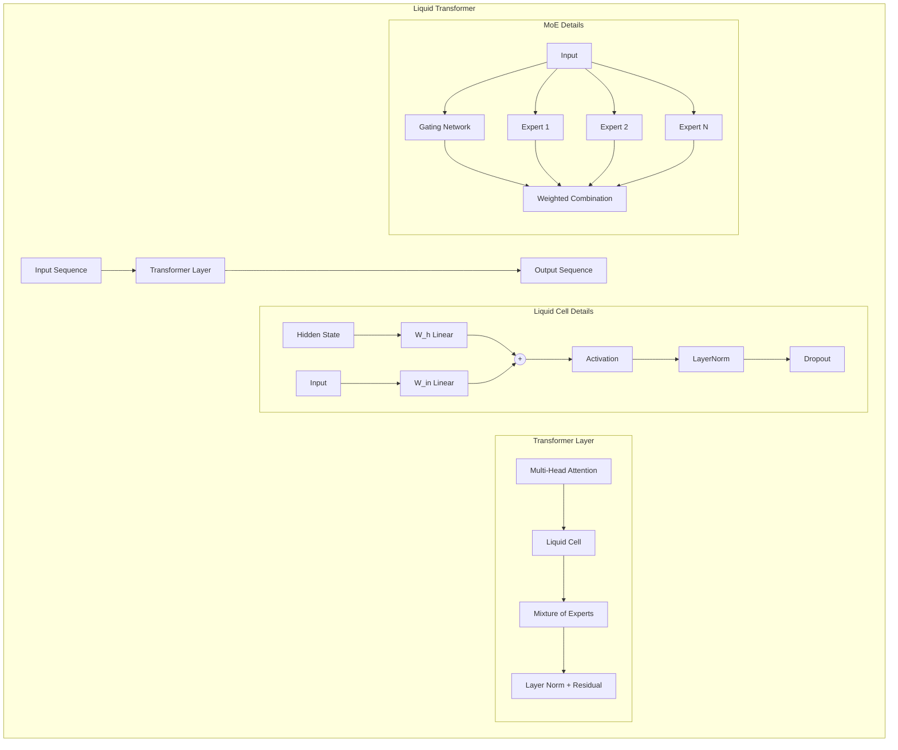

# Liquid Foundation Models [LFMs]

[](https://discord.gg/agora-999382051935506503) [](https://www.youtube.com/@kyegomez3242) [](https://www.linkedin.com/in/kye-g-38759a207/) [](https://x.com/kyegomezb)

**Welcome to the open-source implementation of Liquid Foundation Models (LFMs)** — pioneering the frontier of real-time learning in AI. LFMs are designed to adapt and learn on-the-fly, continuously evolving their knowledge and capabilities as they interact with new data. This real-time learning approach allows LFMs to stay current and relevant in rapidly changing environments, making them ideal for applications that require up-to-the-minute intelligence and adaptability. Whether processing streaming text, analyzing live audio, interpreting real-time video feeds, or responding to dynamic image inputs, LFMs excel at absorbing and applying new information instantaneously. [Discover more about the model from the original article](https://www.liquid.ai/liquid-foundation-models)

## Installation
```bash
$ pip3 install -U lfm-torch
```

## Usage

```python
import torch
from lfm_torch.model import LFModel
from loguru import logger

# Instantiate and test the model
if __name__ == "__main__":
    batch_size, seq_length, embedding_dim = 32, 128, 512
    token_dim, channel_dim, expert_dim, adapt_dim, num_experts = (
        embedding_dim,
        embedding_dim,
        embedding_dim,
        128,
        4,
    )
    model = LFModel(
        token_dim, channel_dim, expert_dim, adapt_dim, num_experts
    )

    input_tensor = torch.randn(
        batch_size, seq_length, embedding_dim
    )  # 3D text tensor
    output = model(input_tensor)
    logger.info("Model forward pass complete.")
```


## Liquid Transformer 
A novel neural architecture combining Liquid Neural Networks, Transformer attention mechanisms, and Mixture of Experts (MoE) for enhanced adaptive processing and dynamic state updates. Very experimental and early! We're working on a training script [here](./liquid_transformer_train.py). It still needs an actual tokenizer like llama's tokenizer but it's getting there. If you can help with this then let me know.


### Architecture Overview




```python
import torch
from loguru import logger

from lfm_torch.liquid_t_moe import LiquidTransformer

# Example usage
if __name__ == "__main__":
    seq_len, batch_size, embed_size = 10, 2, 64
    num_heads, num_experts, expert_size, num_layers = 8, 4, 64, 6

    # Create the model
    model = LiquidTransformer(embed_size, num_heads, num_experts, expert_size, num_layers)

    # Example input tensor
    x = torch.randn(seq_len, batch_size, embed_size)

    # Forward pass
    output = model(x)
    logger.info(f"Model output shape: {output.shape}")
```


# Citations
- All credit for the liquid transformer architecture goes to the original authors: [Google](https://arxiv.org/abs/2402.05385)


# License
This project is licensed under the MIT License. See the [LICENSE](LICENSE) file for details.
